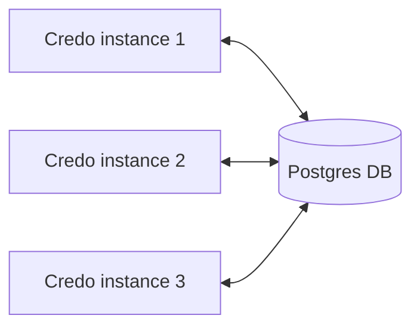
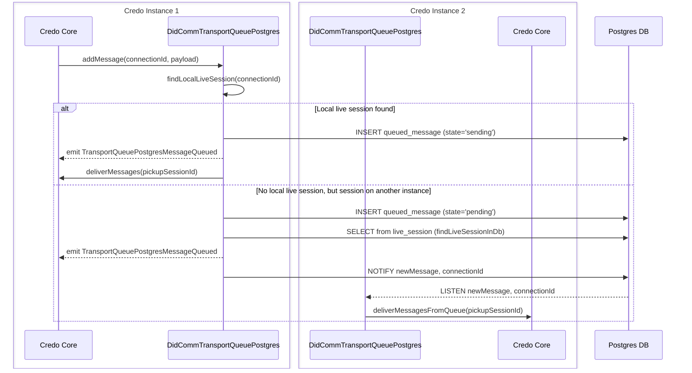
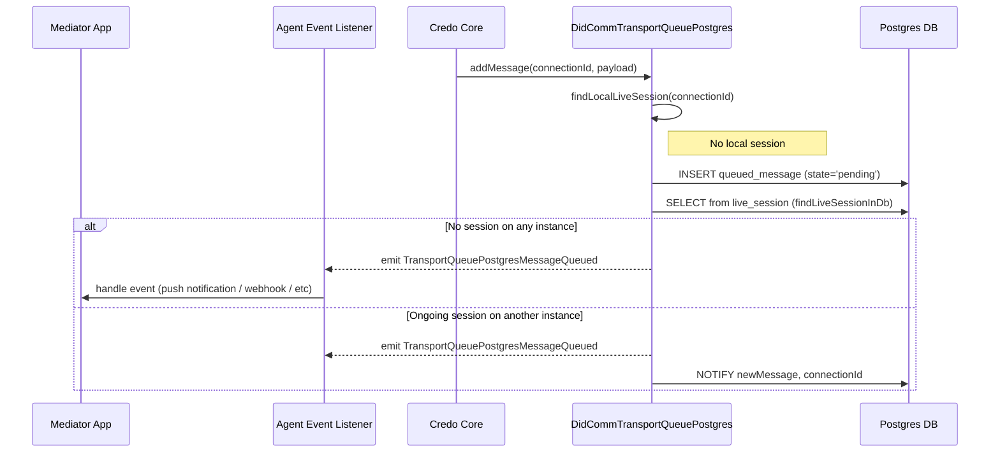

# DIDComm Transport Queue (Postgres) for Credo

## Overview

This package provides an efficient DIDComm queue transport repository for a [Credo](https://github.com/openwallet-foundation/credo-ts) mediator that wishes to persist queued messages (for offline users) in a shared PostgreSQL database and run multiple Credo instances behind a load balancer. Everything without the need of extra components: the same Postgres host used for your Credo wallet can be used for the queue database.



## Features

- **Message storage and retrieval**: saves and fetches DIDComm messages from PostgreSQL.
- **Pub/Sub integration**: uses Postgres `LISTEN`/`NOTIFY` (via [pg-pubsub](https://github.com/voxpelli/node-pg-pubsub)) to notify other instances about new messages for their locally-connected clients.
- **Live session management**: tracks [Message Pickup V2 Live sessions](https://github.com/hyperledger/aries-rfcs/tree/main/features/0685-pickup-v2#live-mode) across instances for efficient live delivery.
- **Instance heartbeats and automatic reaping**: each instance registers and periodically refreshes a row in the `instance` table. Stale `live_session` rows owned by crashed / OOM-killed / scaled-down instances are reaped automatically so that forwarded messages are never addressed to a dead instance.
- **Graceful shutdown**: on controlled shutdown, the instance releases its `live_session` and `instance` rows and wakes any other instance that may own a live session for the affected connections.
- **Automatic database initialization**: creates the database (if needed) and applies schema migrations on startup.
- **Event-driven notifications**: emits a `TransportQueuePostgresMessageQueued` event every time a message is queued. External listeners can react with push notifications, webhooks, metrics, etc.

## How does it work?

`DidCommTransportQueuePostgres` implements the Credo `DidCommQueueTransportRepository` interface and uses three Postgres tables to coordinate multiple instances:

| Table | Purpose |
| --- | --- |
| `queued_message` | Persistent FIFO queue of messages per connection / recipient DID. |
| `live_session` | Tracks which instance currently owns an active Message Pickup Live session for a given connection. |
| `instance` | Heartbeat table used to detect dead instances and reap their stale `live_session` rows. |

It also subscribes to a single Postgres `LISTEN`/`NOTIFY` channel (`newMessage`) on which instances wake each other up when a message arrives for a connection owned by a different instance.

### Message flow

When a new DIDComm message is forwarded for a connection, `addMessage` runs the following logic:

1. Look for a **local** Live mode pickup session for that connection (via the Credo `DidCommMessagePickupApi`).
2. Insert the message into `queued_message` with state:
   - `sending` if there is a local live session (we are going to deliver it immediately).
   - `pending` otherwise.
3. Look for a Live session in the shared `live_session` table (owned by a possibly different instance).
4. Always emit a `TransportQueuePostgresMessageQueued` event with the full message payload and, when known, the owning session. External listeners use this event to trigger push notifications/webhooks when `session` is `undefined` (i.e. the connection is offline everywhere).
5. If there is a local live session → deliver via `messagePickupApi.deliverMessages(...)`.
6. Else if there is a session on another instance → publish `NOTIFY newMessage, connectionId` so the owning instance drains the queue via `deliverMessagesFromQueue(...)`.

> **Note**: at the moment the `newMessage` channel is shared across all connections, so every instance receives every notification and filters by local live session. Per-connection channels were considered but rejected for now since their scalability under large numbers of concurrent online users is unclear.

The following diagrams show the operation when messages arrive in both online and offline scenarios.

#### Online client



#### Offline client



### Live session lifecycle and multi-instance safety

`DidCommTransportQueuePostgres` subscribes to Credo's `DidCommMessagePickupEventTypes.LiveSessionSaved` and `LiveSessionRemoved` events and mirrors them to the shared `live_session` table:

- On **LiveSessionSaved**: inserts a row `(session_id, connection_id, protocol_version, instance)` so that other instances can locate the owner.
- On **LiveSessionRemoved**: deletes only the rows owned by this instance (scoped by `(session_id, instance)`). Any `sending` messages for that connection are then reverted back to `pending`, and a `NOTIFY newMessage` is published to wake up whoever currently owns a live session for that connection. This is important during session migrations between pods, where the old pod's `LiveSessionRemoved` can fire after the new pod's `LiveSessionSaved` has already taken ownership.

To handle crashes where `LiveSessionRemoved` never fires, every instance:

1. Registers a row in the `instance` table on startup and refreshes its `last_seen` every `heartbeatIntervalMs`.
2. Runs a **reaper** every `reaperIntervalMs`, guarded by a Postgres session-level advisory lock so only one instance reaps per tick. The reaper deletes `live_session` rows whose owning `instance` is missing or whose `last_seen` is older than `instanceTimeoutMs`, reverts stuck `sending` messages back to `pending`, and notifies the `newMessage` channel so a surviving owner (if any) resumes delivery.
3. On graceful `shutdown`, removes its own `live_session` and `instance` rows and notifies current owners so that in-flight traffic is handled without waiting for the reaper.

## Database schema

All tables live in the Postgres database configured via `postgresDatabaseName` (defaults to `messagepickuprepository`). Migrations are applied automatically on startup.

### `queued_message`

Stores persisted DIDComm messages. One row per message.

| Column | Type | Description |
| --- | --- | --- |
| `id` | `UUID PRIMARY KEY` (default `gen_random_uuid()`) | Stable message id used by Credo's Message Pickup protocol. |
| `connection_id` | `UUID` | The DIDComm connection the message is addressed to. |
| `recipient_dids` | `TEXT[]` | Recipient DIDs (used by recipient-DID based pickup queries). |
| `encrypted_message` | `JSONB` | The packed DIDComm envelope. |
| `state` | `message_state` enum: `pending` \| `sending` | `pending` = waiting to be picked up; `sending` = currently being delivered to a live session. |
| `created_at` | `TIMESTAMP` (default `CURRENT_TIMESTAMP`) | Insertion time, used for FIFO ordering. |

Indexes: `(connection_id)`, `(connection_id, state)`, `(created_at)`.

### `live_session`

Tracks ongoing Live Mode Message Pickup sessions across the cluster. One row per active live session.

| Column | Type | Description |
| --- | --- | --- |
| `session_id` | `UUID PRIMARY KEY` | Credo's pickup session id. |
| `connection_id` | `VARCHAR(50)` | Owning DIDComm connection. Not unique: multiple rows can coexist briefly during a session migration between instances. |
| `protocol_version` | `VARCHAR(50)` | Message Pickup protocol version (e.g. `v2`). |
| `instance` | `VARCHAR(100)` | Identifier of the instance owning this session (`hostname-pid-uuid`). |
| `created_at` | `TIMESTAMP` (default `CURRENT_TIMESTAMP`) | Insertion time. |

Index: `(connection_id)`.

### `instance`

Heartbeat table used to detect dead instances. One row per live `DidCommTransportQueuePostgres` instance.

| Column | Type | Description |
| --- | --- | --- |
| `name` | `VARCHAR(200) PRIMARY KEY` | Instance identifier (`hostname-pid-uuid`). Matches `live_session.instance`. |
| `last_seen` | `TIMESTAMPTZ NOT NULL DEFAULT now()` | Last heartbeat timestamp. Refreshed every `heartbeatIntervalMs`. |

Index: `(last_seen)`.

## Installation

This module targets Credo 0.6.x (the `@credo-ts/didcomm` package). Newer versions may include breaking changes that require updates to this module.

```bash
npm i @credo-ts/didcomm-transport-queue-postgres
```

or

```bash
yarn add @credo-ts/didcomm-transport-queue-postgres
```

## Usage

Setting up `DidCommTransportQueuePostgres` takes three steps: construct, wire into the DIDComm module as the `queueTransportRepository`, and initialize it against the agent.

### Constructing the repository

```ts
import { DidCommTransportQueuePostgres } from '@credo-ts/didcomm-transport-queue-postgres'

const queueTransportRepository = new DidCommTransportQueuePostgres({
  logger: yourLoggerInstance,
  postgresUser: 'your_postgres_user',
  postgresPassword: 'your_postgres_password',
  postgresHost: 'your_postgres_host',
  postgresDatabaseName: 'your_database_name', // optional, defaults to 'messagepickuprepository'

  // Optional tuning — defaults shown
  heartbeatIntervalMs: 10_000,
  instanceTimeoutMs: 60_000,
  reaperIntervalMs: 30_000,
})
```

If `postgresDatabaseName` is omitted, the default `messagepickuprepository` database is used (and created automatically if it does not exist, using the provided credentials).

`instanceTimeoutMs` should be comfortably larger than `heartbeatIntervalMs` (typically 5–10x) so transient DB/scheduling latency does not cause live instances to be mistakenly reaped.

### Handling the `TransportQueuePostgresMessageQueued` event

The event is emitted on every queued message and carries both the message and (when known) the live session that owns it. Listeners typically send a push notification / webhook only when `session` is `undefined` (i.e. no instance is holding a live session for that connection):

```ts
import {
  PostgresMessageQueuedEvent,
  PostgresMessageQueuedEventType,
} from '@credo-ts/didcomm-transport-queue-postgres'

agent.events.on<PostgresMessageQueuedEvent>(PostgresMessageQueuedEventType, async ({ payload }) => {
  const { message, session } = payload

  if (session) return // Another instance is going to deliver it live

  await notificationService.notify(message.connectionId, message.id)
})
```

Event payload shape:

```ts
{
  message: {
    id: string
    connectionId: string
    recipientDids: string[]
    encryptedMessage: DidCommEncryptedMessage
    receivedAt: Date
    state: 'pending' | 'sending'
  }
  session?: DidCommMessagePickupSession // present when a live session is known (local or on another instance)
}
```

### Wiring it into an agent

`DidCommTransportQueuePostgres` is passed to the `DidCommModule` via its `queueTransportRepository` option, and then initialized against the agent **before** `agent.initialize()`:

```ts
import { Agent } from '@credo-ts/core'
import { DidCommMessageForwardingStrategy, DidCommModule } from '@credo-ts/didcomm'
import { agentDependencies } from '@credo-ts/node'
import {
  DidCommTransportQueuePostgres,
  PostgresMessageQueuedEventType,
} from '@credo-ts/didcomm-transport-queue-postgres'

const queueTransportRepository = new DidCommTransportQueuePostgres({
  postgresHost: 'postgres',
  postgresUser: 'user',
  postgresPassword: 'pass',
})

const agent = new Agent({
  dependencies: agentDependencies,
  config: { label: 'Mediator' },
  modules: {
    didcomm: new DidCommModule({
      queueTransportRepository,
      mediator: {
        autoAcceptMediationRequests: true,
        // Use QueueOnly so forwarded messages are always pushed through the queue
        // (and therefore through DidCommTransportQueuePostgres.addMessage).
        messageForwardingStrategy: DidCommMessageForwardingStrategy.QueueOnly,
      },
    }),
  },
})

await queueTransportRepository.initialize(agent)
await agent.initialize()

agent.events.on(PostgresMessageQueuedEventType, async ({ payload }) => {
  const { message, session } = payload
  // Custom logic (push notifications, webhooks, metrics, ...) here.
})
```

On controlled shutdown, call `queueTransportRepository.shutdown(agent.context)` before `agent.shutdown()` so that this instance releases its `live_session` / `instance` rows and closes the Postgres pool cleanly.

## Migration from `@2060.io/credo-ts-message-pickup-repository-pg`

This package is the successor of `@2060.io/credo-ts-message-pickup-repository-pg`. The main changes are:

- **Class rename**: `MessagePickupRepositoryClient` / `PostgresMessagePickupRepository` → `DidCommTransportQueuePostgres`.
- **Interface rename**: implements Credo 0.6's `DidCommQueueTransportRepository` (formerly `MessagePickupRepository`).
- **Module wiring**: passed as `DidCommModule.queueTransportRepository` (Credo 0.6), instead of `MessagePickupModule.messagePickupRepository` (Credo 0.5).
- **Initialization**: `initialize(agent)` now takes the `Agent` directly (was `initialize({ agent })`). The `connectionInfoCallback` push-notification hook has been removed — notifications are now driven purely by the `TransportQueuePostgresMessageQueued` event, giving consumers a single, consistent entry point.
- **New `shutdown(agentContext)` method**: stops heartbeat/reaper timers, releases this instance's `live_session` / `instance` rows, and closes the Postgres pool.
- **Event rename**: `MessagePickupRepositoryMessageQueued` → `TransportQueuePostgresMessageQueued` (constant exported as `PostgresMessageQueuedEventType`, event type `PostgresMessageQueuedEvent`).
- **Event payload**: previously `{ connectionId, messageId }`; now `{ message: { id, connectionId, recipientDids, encryptedMessage, receivedAt, state }, session? }`. The presence of `session` lets listeners skip push notifications when a live session is known.
- **New `instance` table and heartbeat/reaper**: crashed instances no longer leave permanently stuck `live_session` rows. New config options `heartbeatIntervalMs`, `instanceTimeoutMs` and `reaperIntervalMs` control the cadence.
- **Scoped `live_session` deletion**: `LiveSessionRemoved` deletes only rows owned by the current instance (`session_id` + `instance`), avoiding duplicate delivery during session migrations between pods.
- **Package rename / publisher**: `@2060.io/credo-ts-message-pickup-repository-pg` → `@credo-ts/didcomm-transport-queue-postgres`.
